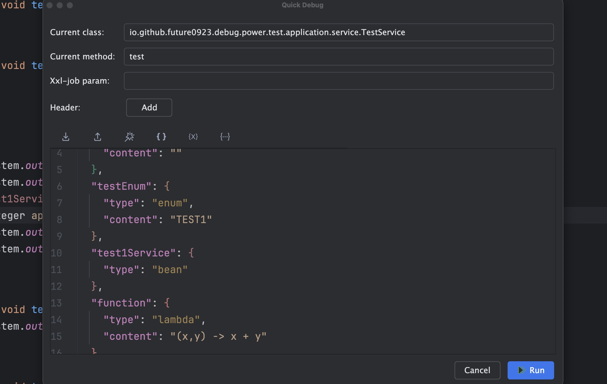
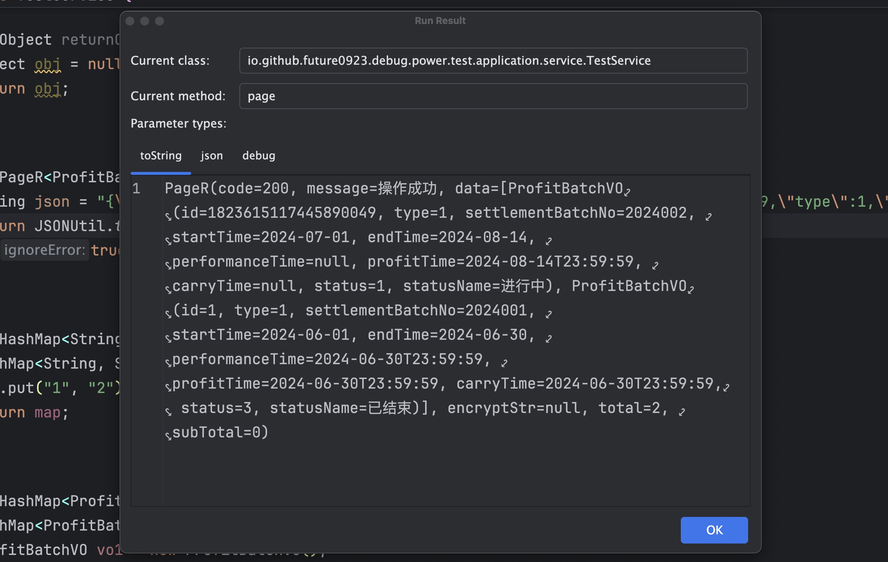
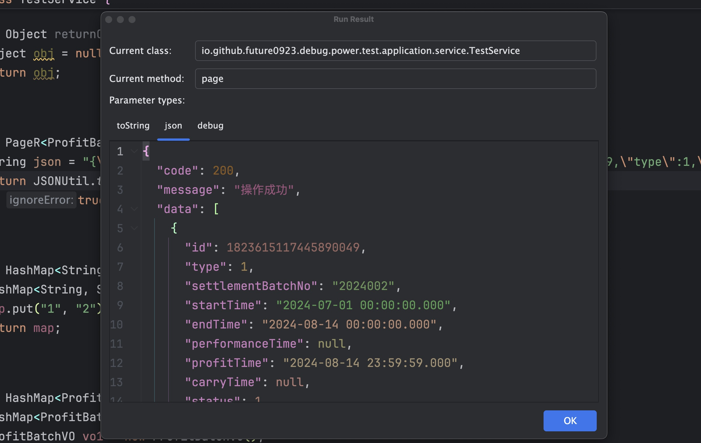
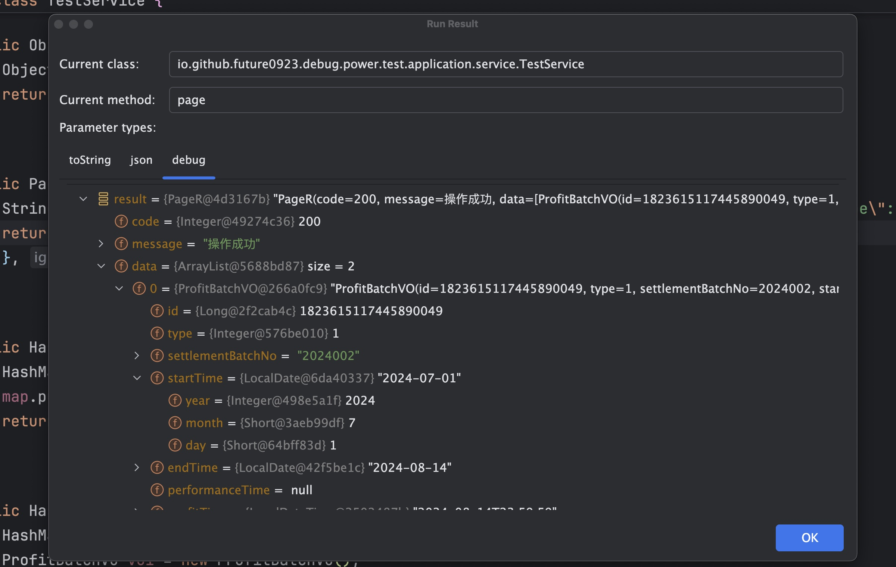
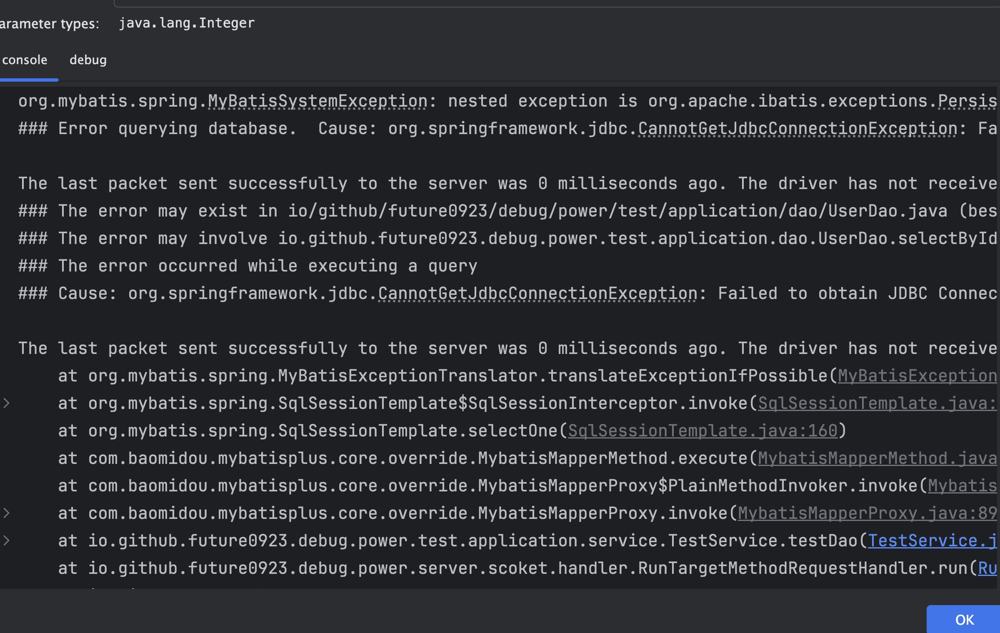
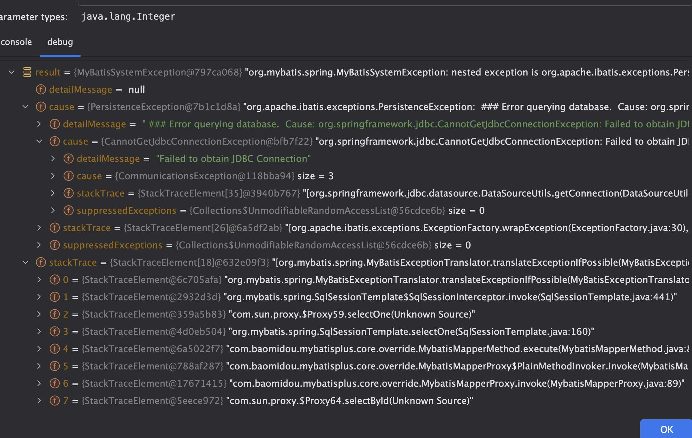
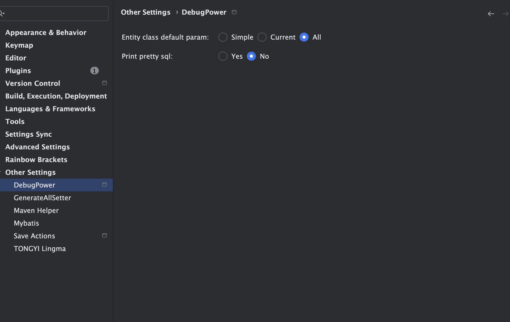

# debug-power

[idea商店地址](https://plugins.jetbrains.com/plugin/24463-debugpower)

- 快速调用任意java方法（静态方法、实例方法、Spring Bean、Mybatis Mapper等），支持权限验证等header传参。
- 打印SQL执行语句与耗时时间(mysql、postgresql、sqlserver、clickhouse、oracle)

# Quick Start

- 启动项目
- 项目启动成功后点击工具窗口的加号选择对应应用，可以配置全家Header信息

- 在对应的方法体上右键唤醒菜单（也可以自己设置快捷键），
  - `Quick Debug` 调用方法
  - `Execute Last` 快速调用上一次执行的方法

- 点击 `Run` 调用目标应用方法，可以设置当前方法要传递的Header信息

- 调用成功后返回执行的对应结果
  - 调用成功返回方法执行结果
    - `toString` 
  
    - `json`
  
    - `debug`
  
  - 调用失败返回错误信息
    - `console` 
  
    - `debug`
  
- 修改配置
  - `Entity class default param` 打开当前方法的实体类默认值：没有默认、当前类、所有父类（最多5层）
  - `Print pretty sql` 打印执行的SQL语句：不打印、打印
