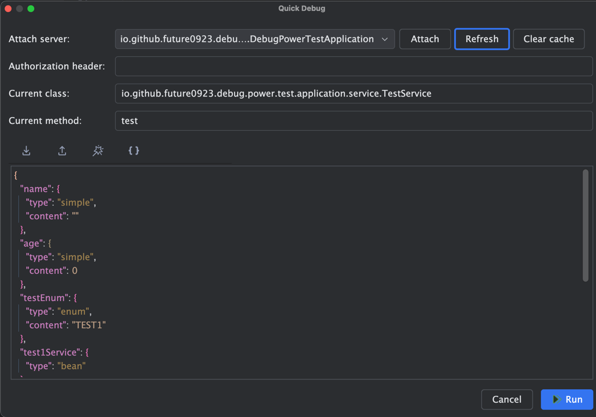
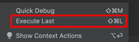
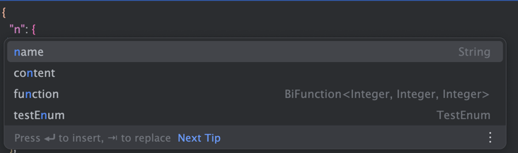
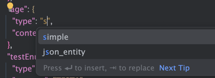
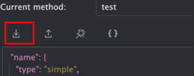
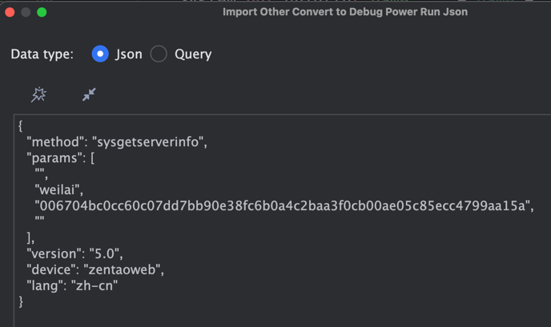
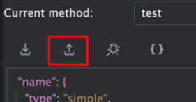
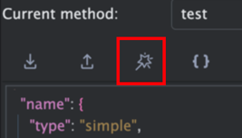
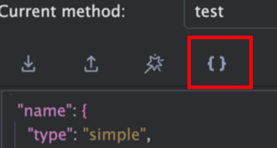

# debug-power

- 当你要调试Job Client方法的时候，你要通过Job Server才能调用到方法运行。
- 当你要调试MQ方法的时候，你要发送MQ信息才能调用到方法运行。
- 当你发送RPC请求的时候，要通过RPC请求才能调用到方法运行。
- 当你要测试入口比较深的方法时，通过从controller层postman接口会很麻烦，而且请求参数很复杂，再加上业务参数的验证，非常不容易调用到你测试的这个。
- 当你有前端参数，想快捷访问到这个接口时，需要打开api工具才能访问。
- 。。。

当然你也可以选择写单元测试进行调试，手写你要写单元测试（不要求单元测试覆盖率的话），然后启动它。
**如果你觉得这样有一些麻烦，不妨尝试一下这个调试工具。**

# What is this?

快捷请求调试工具，不管是api接口，但是内部的方法，都可以快捷请求。

# Quick Start

idea插件地址：[file/DebugPowerIdeaPlugin.zip](file/DebugPowerIdeaPlugin.zip)

- 首先你要启动服务，然后在你要调试运行的方法中右键点击 `Quick Debug`。


- 你会看到如下界面。会自动给出当前的当前启动的服务、当前的类、当前的方法和根据方法参数自动生成要请求的json实体对象。



- 选择你要调试的服务，然后点击 `attach` 按钮（如果你要刷新列表，清除缓存也可以点击另外两个）。**当你运行项目的时候，会启动attach到当前启动的服务上**。

- 如果你要登陆认证等功能，可以指定 `Authorization Header`，他会mock一个request并加上这个请求头，设置到 spring 的 `RequestContextHolder` 中，这样后续就可以拿到。

- 如果你要修改，可以修改对应的参数即可。

**执行上次**

上面的操作会发起当前所在方法的请求，如果你已经不再当前方法了还想执行上次，点击 `Execute Last` 即可执行上次请求。



# Param

## 参数的类型

格式为参数名字和信息，信息为 `io.github.future0923.debug.power.common.dto.RunContentDTO`。

### 参数名
会自动生成参数名，如果你想写，也会有提示。



通过指定 `type` 来告诉这个参数是什么类型，对应实体为 `io.github.future0923.debug.power.common.enums.RunContentType`。
- simple：基础类型。
- enum：枚举类型。会通过 `Enum.valueOf()` 进行反序列化，默认生成的是枚举的第一个值。
- bean：bean类型。会从spring容器中通过`class`获取bean。
- lambda：lambda类型。会通过 `LambdaMetafactory` 进行反序列化。
- json_entity：json实体类型。会通过json进行反序列化生成实体对象。

看起来有一点繁琐，所以打开方法的时候会自动根据方法的参数类型自动生成对应的类型，如果你想自己写，编辑器中也会有对应的提示。



通过指定 `content` 来告诉这个参数是什么内容。如果是 `bean` 类型可以不指定。

## 缓存

当你点击 `Run` 运行完之后，会自动将请求的参数缓存下来，下次运行时，会自动填充。

## 工具栏


### 导入



当你有前端给你的正常 `json` 或者 `query` 的时候，你可以通过 `import` 按钮导入参数，会自动生成运行时要的参数，然后你就可以运行了。

**Json 格式：**



**Query 格式：**
```text
# 情况1
https://www.iconfont.cn/api/common/suggest.json?q=import&type=icon&t=1715302971995&ctoken=TSzvd6zR0QMhoi2wCCSC5xNm
# 情况2
?q=import&type=icon&t=1715302971995&ctoken=TSzvd6zR0QMhoi2wCCSC5xNm
# 情况3
q=import&type=icon&t=1715302971995&ctoken=TSzvd6zR0QMhoi2wCCSC5xNm
```

**Path 格式：**
```text
# 情况1
/arg1/arg2
# 情况2
arg1/arg2
# 情况3
arg1/arg2/
# 情况4
/arg1/arg2/
```


### 导出



当 `DebugPower` 缓存的数据你想通过postman等工具请求是，你可以点击 `export` 按钮导出 `json` `query` `path` 参数。

### 美化



格式化json数据。

### 重新生成不带默认值的参数



当你写乱的时候，你可以点击它重新根据方法参数生成不带默认值的参数，然后自己填写。


### 重新生成带默认值的参数


当你写乱的时候，你可以点击它重新根据方法参数生成带默认值可执行的参数。
