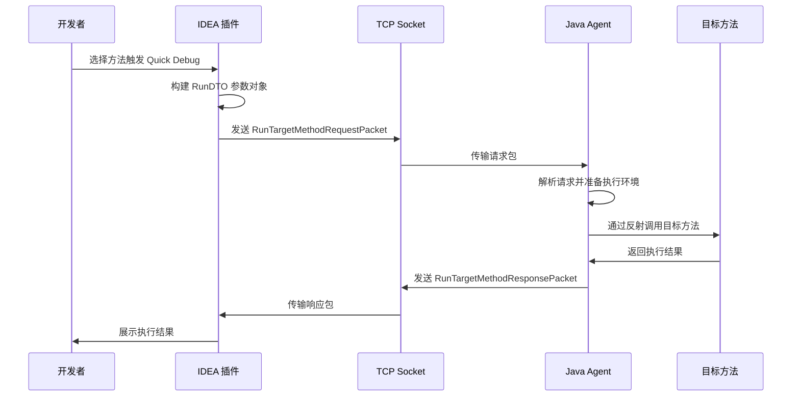

# Debug Tools Quick Debug 技术实现原理

## 📖 概述

本文档深入分析 Debug Tools 中 Quick Debug（快速调用任意方法）功能的底层技术实现原理，重点解释为什么可以跨进程调用目标 JVM 中的任意方法。

## 🏗️ 整体架构设计

### 系统架构图

```
┌─────────────────┐    TCP/HTTP 通信   ┌─────────────────┐
│   IntelliJ IDEA │ ◄────────────────► │   目标 JVM      │
│     插件        │                    │     进程        │
│                 │                    │                 │
│ • UI 界面       │                    │ • Java Agent    │
│ • 方法选择      │                    │ • 方法执行器    │
│ • 参数编辑      │                    │ • 类加载器管理  │
│ • 结果展示      │                    │ • 实例获取      │
└─────────────────┘                    └─────────────────┘
```

### 核心组件交互流程



## 🔧 底层核心技术原理

### 1. Java Agent 技术原理

#### Agent 加载机制
```java
// JVM 启动时加载 Agent
public static void premain(String agentArgs, Instrumentation inst) {
    // 初始化 Debug Tools Agent
    DebugToolsBootstrap.getInstance(inst).start(agentArgs);
}

// 运行时动态附加 Agent  
public static void agentmain(String agentArgs, Instrumentation inst) {
    DebugToolsBootstrap.getInstance(inst).start(agentArgs);
}
```

**关键技术点**：
- **Instrumentation API**：JVM 提供的标准接口，允许在运行时修改类字节码
- **ClassFileTransformer**：监控类加载过程，实现热重载功能
- **类重定义**：支持运行时修改已加载的类

#### 为什么可以跨进程调用？

**答案在于 Java 的进程间通信和类加载机制**：

1. **JVM TI (Tool Interface)**：Java 提供的标准工具接口，支持跨进程调试和监控
2. **Attach API**：`com.sun.tools.attach` 包提供的进程附加能力
3. **Socket 通信**：建立稳定的双向通信通道

```java
// 跨进程附加示例
VirtualMachine vm = VirtualMachine.attach(pid);
vm.loadAgent(agentPath, agentArgs);
```

### 2. 类加载器隔离与穿透

#### 类加载器层次结构
```
Bootstrap ClassLoader
     ↑
Extension ClassLoader  
     ↑
Application ClassLoader
     ↑
Custom ClassLoaders (Spring, Tomcat, etc.)
```

#### 跨类加载器访问挑战
```java
// 不同类加载器加载的相同类是不相等的
Class<?> class1 = ClassLoader1.loadClass("com.example.Service");
Class<?> class2 = ClassLoader2.loadClass("com.example.Service");
// class1 != class2  // true
```

#### Debug Tools 的解决方案
```java
public class DebugToolsEnvUtils {
    // 扩展类加载器，用于穿透框架隔离
    private static final Map<ClassLoader, DebugToolsExtensionClassLoader> 
        EXTENSION_CLASS_LOADER_MAP = new HashMap<>();

    public static DebugToolsExtensionClassLoader getExtensionClassLoader(ClassLoader classLoader) {
        // 创建能够访问框架内部类的扩展类加载器
        DebugToolsExtensionClassLoader extensionClassLoader = 
            new DebugToolsExtensionClassLoader(urls, classLoader);
        EXTENSION_CLASS_LOADER_MAP.put(classLoader, extensionClassLoader);
        return extensionClassLoader;
    }
}
```

### 3. 反射技术的深度应用

#### 方法调用核心实现
```java
public class RunTargetMethodRequestHandler {

    public void handle(OutputStream outputStream, RunTargetMethodRequestPacket packet) {
        // 1. 加载目标类（跨类加载器）
        Class<?> targetClass = DebugToolsClassUtils.loadClass(className, classLoader);

        // 2. 获取方法对象
        Method targetMethod = targetClass.getDeclaredMethod(methodName, parameterTypes);

        // 3. 设置方法可访问（突破私有方法限制）
        ReflectUtil.setAccessible(targetMethod);

        // 4. 获取目标实例
        Object instance = BeanInstanceUtils.getInstance(targetClass, targetMethod);

        // 5. 执行方法调用
        Object result = targetMethod.invoke(instance, args);
    }
}
```

#### 实例获取策略详解
```java
public class BeanInstanceUtils {

    public static Object getInstance(Class<?> targetClass, Method targetMethod) {
        // 策略1：从Spring容器获取（支持IoC框架）
        Object springBean = DebugToolsEnvUtils.getLastBean(targetClass);
        if (springBean != null) return springBean;

        // 策略2：从JVM已加载实例中获取
        Object[] jvmInstances = JvmToolsUtils.getInstances(targetClass);
        if (jvmInstances.length > 0) return jvmInstances[jvmInstances.length - 1];

        // 策略3：反射创建新实例
        return instantiate(targetClass);
    }
}
```

### 4. 序列化与通信协议

#### 请求响应数据结构
```java
// 请求数据包
public class RunTargetMethodRequestPacket extends Packet {
    private RunDTO runDTO;  // 包含方法调用所有信息
}

// 执行参数对象
public class RunDTO {
    private String targetClassName;           // 目标类名
    private String targetMethodName;          // 方法名
    private List<String> parameterTypes;      // 参数类型列表
    private Map<String, RunContentDTO> content; // 参数值映射
    private String classLoaderIdentity;       // 类加载器标识
}
```

#### 复杂对象处理机制
```java
// 结果缓存与引用传递
public class RunTargetMethodResponseHandler {

    private void printResult(Object result, RunDTO runDTO, OutputStream outputStream) {
        if (result != null && !isSimpleValueType(result.getClass())) {
            // 复杂对象：生成唯一标识并缓存
            String offsetPath = RunResultDTO.genOffsetPathRandom(result);
            DebugToolsResultUtils.putCache(offsetPath, result);
            packet.setOffsetPath(offsetPath);  // 返回引用标识
        }
    }
}
```

## 🚀 关键技术突破点

### 1. 框架集成支持

#### Spring Framework 集成
```java
public class DebugToolsEnvUtils {

    public static Object getLastBean(Class<?> targetClass) {
        // 通过反射访问Spring ApplicationContext
        Class<?> springUtil = getSpringEnvUtilClass();
        Method getBeanMethod = springUtil.getMethod("getLastBean", Class.class);
        return getBeanMethod.invoke(null, targetClass);
    }
}
```

#### 代理对象处理
```java
// 支持AOP代理对象的方法调用
if (instance instanceof Proxy) {
    InvocationHandler handler = Proxy.getInvocationHandler(instance);
    if (DebugToolsEnvUtils.isAopProxy(handler)) {
        // 直接调用代理处理器，绕过AOP拦截链
        return handler.invoke(instance, method, args);
    }
}
```

### 2. 动态代码生成与热更新

#### 运行时方法环绕
```java
public class RunTargetMethodRequestHandler {

    // 支持动态编译和类重定义
    if (StrUtil.isNotBlank(runDTO.getMethodAroundContent())) {
        DynamicCompiler compiler = new DynamicCompiler(classLoader);
        compiler.addSource(RunMethodAround.class.getName(), runDTO.getMethodAroundContent());

        // 运行时重定义类字节码
        instrumentation.redefineClasses(
            new ClassDefinition(aroundClass, compiler.buildByteCodes())
        );
    }
}
```

### 3. 性能优化策略

#### 连接池管理
```java
public class SocketSendUtils {
    // 复用Socket连接，减少建立连接的开销
    private static final Map<String, SocketClient> CLIENTS = new ConcurrentHashMap<>();

    public static void send(Project project, Packet packet) {
        SocketClient client = CLIENTS.computeIfAbsent(
            project.getName(), k -> new SocketClient(host, port)
        );
        client.send(packet);
    }
}
```

#### 结果缓存机制
```java
public class DebugToolsResultUtils {
    // 使用WeakHashMap避免内存泄漏
    private static final Map<String, SoftReference<Object>> RESULT_CACHE = 
        Collections.synchronizedMap(new LinkedHashMap<>());

    public static void putCache(String key, Object value) {
        RESULT_CACHE.put(key, new SoftReference<>(value));
    }
}
```

## 🔍 底层原理深入解析

### 为什么可以调用其他进程的方法？

#### 技术基础：Java Virtual Machine Tool Interface (JVMTI)

**JVMTI 能力**：
- **进程间通信**：通过共享内存或Socket实现跨进程数据交换
- **类加载监控**：监控目标JVM的类加载过程
- **字节码操作**：在运行时修改已加载的类字节码
- **堆内存访问**：读取和修改目标JVM的内存数据

#### Attach API 工作机制

```java
// 1. 查找目标JVM进程
List<VirtualMachineDescriptor> vmds = VirtualMachine.list();

// 2. 附加到目标进程
VirtualMachine vm = VirtualMachine.attach(pid);

// 3. 加载Agent到目标JVM
vm.loadAgent(agentJarPath, agentArgs);

// 4. 建立通信通道
// Agent在目标JVM中启动TCP服务器等待连接
```

#### 内存空间隔离与穿透

**传统进程隔离**：
- 每个JVM进程有独立的内存空间
- 进程间无法直接访问对方的内存

**Debug Tools的突破**：
```
本地JVM进程         目标JVM进程
    ↓                   ↓
Socket客户端  ←→  Socket服务端 (Agent)
    ↓                   ↓
             反射调用目标方法
    ↓                   ↓
             返回序列化结果
```

### 类加载器穿透技术

#### 类加载器隔离问题
```java
// 问题：不同类加载器加载的类不兼容
ClassLoader cl1 = new URLClassLoader(urls1);
ClassLoader cl2 = new URLClassLoader(urls2);

Class<?> class1 = cl1.loadClass("com.example.Service");  // Class@1234
Class<?> class2 = cl2.loadClass("com.example.Service");  // Class@5678

// class1 != class2  // true - 类型不兼容
```

#### Debug Tools的解决方案：类加载器委托
```java
public class DebugToolsExtensionClassLoader extends URLClassLoader {
    private final ClassLoader parent;

    public DebugToolsExtensionClassLoader(URL[] urls, ClassLoader parent) {
        super(urls, parent);  // 关键：设置父类加载器
        this.parent = parent;
    }

    @Override
    protected Class<?> loadClass(String name, boolean resolve) {
        // 优先从父加载器（目标应用的类加载器）加载
        synchronized (getClassLoadingLock(name)) {
            Class<?> c = findLoadedClass(name);
            if (c == null) {
                try {
                    if (parent != null) {
                        c = parent.loadClass(name);
                    }
                } catch (ClassNotFoundException e) {
                    // 父加载器找不到，自己加载
                }
                if (c == null) {
                    c = findClass(name);
                }
            }
            return c;
        }
    }
}
```

## 🛡️ 安全机制

### 权限控制
```java
// 方法访问权限检查
public static Object getInstance(Class<?> targetClass, Method targetMethod) {
    if (!Modifier.isPublic(targetMethod.getModifiers())) {
        // 非公共方法需要特殊处理
        return DebugToolsEnvUtils.getTargetObject(instance);
    }
    return instance;
}
```

### 资源清理
```java
// 确保资源正确释放
try {
    // 执行方法调用
    result = method.invoke(instance, args);
} finally {
    // 恢复线程上下文类加载器
    Thread.currentThread().setContextClassLoader(originalClassLoader);
    // 清理临时资源
    DebugToolsEnvUtils.cleanup();
}
```

## 📊 性能考量

### 优化策略

1. **连接复用**：TCP连接池避免频繁建立连接
2. **结果缓存**：复杂对象引用传递减少序列化开销  
3. **异步处理**：非阻塞IO提高并发性能
4. **内存管理**：使用软引用避免内存泄漏

### 性能指标

- **方法调用延迟**：通常 < 100ms
- **并发支持**：支持多个并发调试会话
- **内存占用**：Agent内存占用 < 50MB

## 🎯 技术总结

Debug Tools Quick Debug 功能的实现基于以下核心技术：

1. **Java Agent 技术**：实现跨进程代码注入和执行
2. **反射机制**：动态调用目标方法
3. **类加载器穿透**：解决框架隔离问题  
4. **序列化通信**：实现进程间数据交换
5. **动态编译**：支持运行时代码修改

这种架构设计使得开发者能够在不修改源代码的情况下，直接调用生产环境或测试环境中运行的应用的任意方法，极大地提升了调试效率。

---
*文档版本: v1.0*
*最后更新: 2025-12-28*